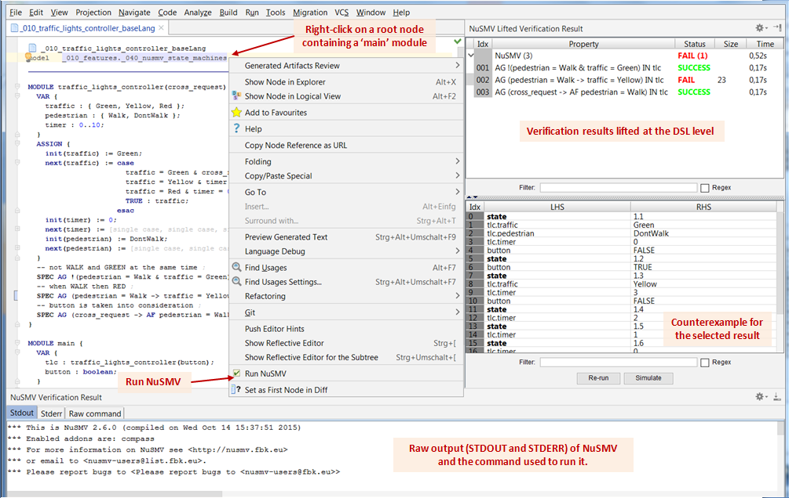
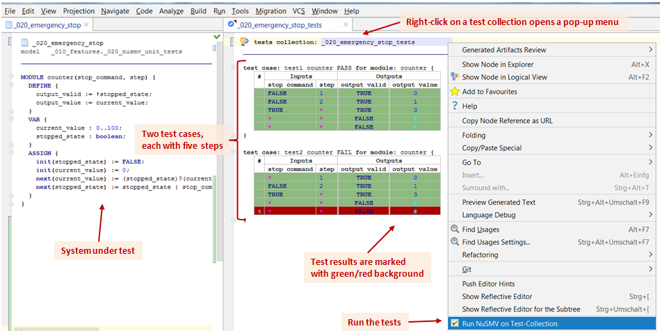
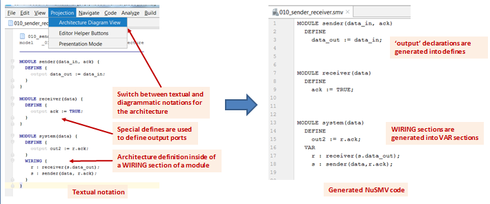
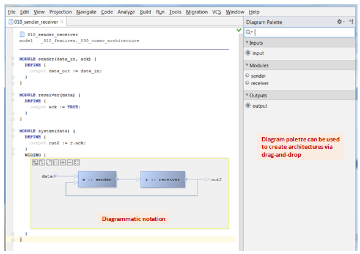

## FASTEN: Formal Specification Environment
Homepage: **[FASTEN](https://sites.google.com/site/fastenroot/)**

* [Overview](#overview)  
* [Download](#download) 
* [NuSMV Integration](#nusmv_integration)
  * [Base Language](#nusmv_base_language)
  * [Unit Testing](#nusmv_unit_testing)
  * [Architecture](#nusmv_architecture)
  
<a name="overview"/>
#### Overview
FASTEN is an integrated environment for the formal specification of systems which aims to
* make formal verification easy to use by practicing engineers, and 
* provide verification experts with higher level abstractions which ease the specification of systems.

As of now, we integrate the **[NuSMV](http://nusmv.fbk.eu)** and **[Spin](http://http://spinroot.com/)** model checkers. 
The integration of Spin is in earlier phases and thereby not part of the binary distribution.

At the core of FASTEN are a set of domain specific languages (DSLs) developed with **[Jetbrains MPS](https://www.jetbrains.com/mps/)** language workbench.
The DSLs are built in a modular fashion, can be further extended with new abstractions. From these DSLs we generate either NuSMV or Promela code.

<a name="download"/>
#### Download
FASTEN distributions (for Windows) can be downloaded from [here](https://github.com/mbeddr/mbeddr.formal/releases).
Start FASTEN by running: 'bin\fasten.bat' from the installation directory. 
A tutorial project containing the users guide with examples for all important features can be found in the 'tutorial' directory.

<a name="nusmv_integration"/>
#### NuSMV Integration

The NuSMV integration features a stack of languages which extend the SMV language. 
You can call NuSMV directly on a model by doing the following steps: 
* Right-click on a root node
* Select 'Run NuSMV'
  * the text file containing the NuSMV code is generated and NuSMV run on it
  * the verification results are subsequently lifted and displayed in the IDE
  * the command used to run NuSMV is given in the 'Raw command' tab of the 'Verification Result' window

<a name="nusmv_base_language"/>
##### Base Language
We have implemented the most important features of the NuSMV language. There are only a handful of differences between our implementation and the language specified in the [NuSMV manual](http://nusmv.fbk.eu/NuSMV/userman/v26/nusmv.pdf).

1. NuSMV modules can be written in different root nodes. The generator automatically combines all referenced modules in a single root and generates a single '*.smv' file.

You can choose between specifying the systems using directly the input language of NuSMV or any other DSL extension from below when appropriate.

<a name="nusmv_unit_testing"/>
##### Unit Testing
We can write unit tests on a module and organize them into test collections:
- inputs of the module are its parameters, 
- outputs are the DEFINEs.

Test vectors:
- input vectors can be either constants or "any value" (denoted through stars '*'), and 
- expected outputs can either be constants or "don't care" (denoted through hashes '#').

Running tests can be done via a pop-up menu on a test collection or a test case. The results of the test execution are marked in the IDE with a background color. In case of test failures, a counterexample is given in the results window.

<a name="nusmv_architecture"/>
##### Architecture

A WIRING section of a module is a special VAR section and is used to describe the wiring of components in an architecture. Compared to a VAR section, a WIRING section has the following differences:
- all variables should have module types
- actual parameters of modules are allowed to be only 
  - constants (e.g. '1', 'TRUE'), 
  - references to input ports of the composite module, or 
  - reference to output ports of the instantiated modules through other variables.

Components are special kinds of modules which have special kinds of DEFINEs called 'outputs'. 
The translation to the NuSMV base language is straight forward:
- WIRING sections translate into VAR sections, and 
- 'output' declarations into definitions.

To switch between textual and diagramatic notations for an architecture you can use 'Projection -> Architecture Diagram View' menu.

<a name="nusmv_state_machines"/>
##### State Machines

